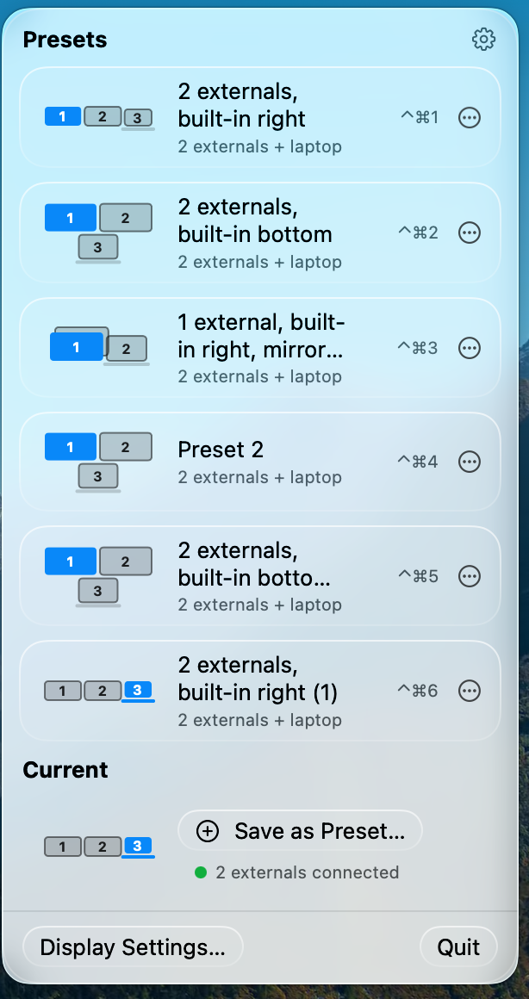

# Arrange Display

One-click macOS display arrangement presets from the menu bar. Save how your monitors are arranged — positions, main display, mirroring, resolution and refresh rate — and restore any setup with a single click, without ever opening System Settings.



## Requirements

- **macOS 26 (Tahoe) or later** — the panel is built on the Liquid Glass design APIs
- **Apple Silicon** Mac (M1 or newer)

## Download

- **[⬇ Download ArrangeDisplay.dmg](https://github.com/liamlilhy-ship-it/arrange-display/releases/latest/download/ArrangeDisplay.dmg)** — open it and drag the app into the Applications shortcut
- [ArrangeDisplay.zip](https://github.com/liamlilhy-ship-it/arrange-display/releases/latest/download/ArrangeDisplay.zip) (plain zip) · [All releases](https://github.com/liamlilhy-ship-it/arrange-display/releases)

### First launch

The app is self-signed, so macOS asks about it — **once, on the first install**:

1. Double-click the app. macOS says it can't check it for malicious software.
2. Open **System Settings → Privacy & Security**
3. Scroll down, click **Open Anyway**, and confirm

The app then opens normally, every time after.

(Right-click → **Open** does *not* work for this any more — macOS removed that
shortcut in Sequoia.)

### Updating

Open the panel → gear icon → **Check for Updates…**

The app never checks, downloads, or installs anything on its own — it only
looks when you ask it to. If there is a newer version you get its details and
an Install button; if not, it says so and nothing happens.

Updating this way takes a few seconds and asks nothing else of you:

- **No repeat of the first-launch steps.** The update is installed by the app
  itself, so macOS does not treat it as a new unknown download.
- **Your presets and settings are kept.** They live outside the app, so they
  carry over untouched — layouts, order, names, panel style, and language.

You can always download a fresh copy from the link above instead. That works
too, but macOS treats it as a brand-new app, so you would repeat the three
first-launch steps each time. Checking from inside the app avoids that.

## User manual

Click the two-displays icon in the menu bar to open the panel. Click any preset to apply it — a banner confirms, and the green dot in the Current section shows how many external monitors are detected.

### Key features

- **One-click presets** — each preset restores screen positions, the main display, mirroring, and each monitor's resolution / scaling / refresh rate
- **Hotkeys** — ⌃⌘1 through ⌃⌘9 apply the first nine presets from anywhere, no permission prompts; the numbers follow the menu order, each row shows its key, and a floating confirmation appears when the menu is closed
- **Fits any matching hardware** — a preset applies whenever the connected screen counts match (laptop + N externals); externals are assigned left-to-right and positions scale to the real monitor sizes
- **Exact-monitor memory** — when the very monitors a preset was saved with are connected, each one silently gets its remembered position and display mode back
- **Current section** — a live thumbnail of the present arrangement with the external-monitor count; "Save as Preset…" captures it with an auto-suggested name
- **Organize** — ⋯ on any row (or right-click) for Reorder / Rename / Delete; duplicate names are rejected with a warning
- **Two panel styles** — Blur (translucent Liquid Glass, adjustable frost) or Clear (blur-free dark panel, adjustable transparency), switched in Settings (gear icon)
- **English / 中文** — switch the interface language in Settings
- **Display Settings… shortcut** — jumps straight to System Settings → Displays

In the row thumbnails: blue = main screen, the laptop shape = built-in display, numbers = screen order, stacked cards = mirrored displays.

### Default presets

Three presets ship with the app (they can be renamed, reordered, or deleted like any other):

| Preset | Needs | Arrangement |
|---|---|---|
| 1 external, built-in bottom | 1 external + laptop | External on top (main), laptop centered underneath |
| 2 externals, built-in right | 2 externals + laptop | Two externals side by side (left one main), laptop to the right |
| 2 externals, built-in bottom | 2 externals + laptop | Two externals side by side (left one main), laptop bottom-middle |

Presets that don't fit the currently connected screens appear dimmed until the matching monitors are plugged in.

## Build from source

```bash
./build.sh
open build/DisplayManager.app
```

Publishing a release (signing key, feed URL, the per-release steps) is
documented in [docs/RELEASING.md](docs/RELEASING.md).

## CLI (for testing/scripting)

```bash
.build/release/DisplayManager list             # show connected displays
.build/release/DisplayManager apply <a|b|c>    # apply a built-in preset
.build/release/DisplayManager capture <path>   # save current arrangement to JSON
.build/release/DisplayManager restore <path>   # apply arrangement from JSON
.build/release/DisplayManager profiles         # list saved presets
.build/release/DisplayManager profile <name>   # apply a saved preset
```
